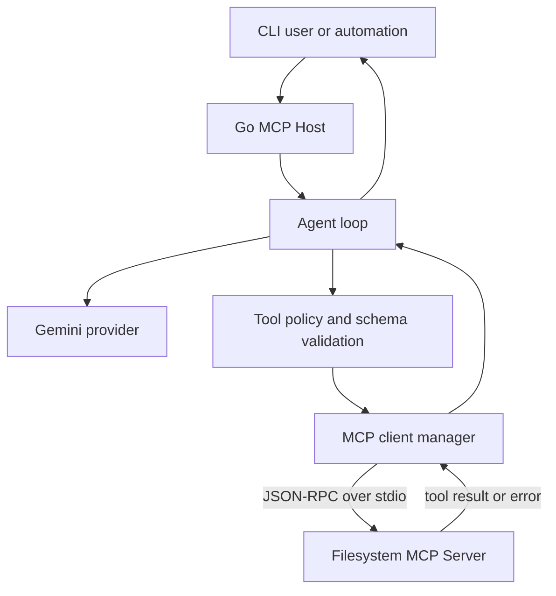

# Tech Design Document - Custom MCP Host

## 1. Muc tieu va pham vi MVP

MVP la mot Custom MCP Host headless viet bang Go. Host nhan prompt tu CLI, ket noi mot Filesystem MCP Server qua `stdio`, va dieu phoi Gemini de thuc hien tool call truoc khi tra ve text cuoi cung.

MVP bao gom:

- Gemini la LLM provider duy nhat.
- `@modelcontextprotocol/server-filesystem` la MCP Server dau tien.
- JSON-RPC 2.0 qua `stdio` cho MCP transport.
- CLI nhan prompt tu argument hoac stdin va ghi ket qua ra stdout.

MVP khong bao gom HTTP/SSE, Next.js, PostgreSQL, Docker/CLI MCP, DeepSeek, hay Ollama. Cac phan nay la extension sau khi AC1-AC4 cua MVP dat.

## 2. System Architecture



### 2.1 Module boundaries

| Module | Responsibility | Dependency direction |
|---|---|---|
| `cmd/server` | Load config, construct dependencies, run CLI, process shutdown. | Depends on `internal/*`. |
| `internal/config` | Parse and validate environment configuration. | No application dependency. |
| `internal/mcpclient` | Start and stop MCP child process; initialize; list and call tools. | Depends on `mcp-go`. |
| `internal/llm` | Provider-neutral LLM interface and Gemini adapter. | Gemini adapter depends on Google SDK. |
| `internal/agent` | Agentic loop and conversation state. | Depends only on LLM and MCP interfaces. |
| `internal/policy` | Executable, tool, root-path, schema, and result-size policy. | Used before each tool call. |

`agent` must not depend on `mcp-go` or a Gemini SDK directly. This keeps future DeepSeek/Ollama providers and new MCP transports isolated behind adapters.

## 3. Tech Stack

- **Language:** Go 1.26.5, as declared in `go.mod`.
- **MCP:** `github.com/mark3labs/mcp-go` over local `stdio`.
- **LLM:** Official Google Gen AI Go SDK, wrapped by the `internal/llm` Gemini adapter.
- **Configuration:** Environment variables loaded optionally from `.env` in local development.
- **Protocol:** MCP JSON-RPC 2.0 over `stdio`.
- **Tests:** Go standard `testing`; fakes for unit tests; a sandboxed real Filesystem MCP integration test.

## 4. Configuration Contract

The application must fail fast with a descriptive error when required configuration is invalid. Secrets must never be printed.

| Variable | Required | Purpose |
|---|:---:|---|
| `GEMINI_API_KEY` | Yes | Gemini credential. |
| `GEMINI_MODEL` | Yes | Gemini model name. |
| `MCP_FILESYSTEM_COMMAND` | Yes | Approved executable used to start the Filesystem MCP Server. |
| `MCP_FILESYSTEM_ARGS_JSON` | Yes | JSON array of child-process arguments. |
| `MCP_ALLOWED_ROOTS` | Yes | Comma-separated directories the server may expose. |
| `MCP_TIMEOUT` | Yes | Timeout for initialize, discovery, and each MCP tool call. |
| `LLM_TIMEOUT` | Yes | Timeout for each Gemini request. |
| `AGENT_MAX_ITERATIONS` | Yes | Maximum LLM-to-tool iterations per prompt. |
| `MCP_MAX_RESULT_BYTES` | Yes | Maximum serialized tool result retained in context. |
| `HOST_LOG_LEVEL` | No | Log verbosity; defaults to `info`. |

## 5. MCP Client Lifecycle

1. Validate the configured command, JSON arguments, and allowed roots before spawning a process.
2. Start the child process with a context owned by the current prompt execution.
3. Create the stdio MCP client and complete the MCP initialize handshake within `MCP_TIMEOUT`.
4. Call `tools/list` once and retain the discovered tools for this execution.
5. Validate every `tools/call` against the discovered tool name, tool schema, and policy before sending it to MCP.
6. Close the MCP client and terminate the child process when the prompt completes, fails, or its context is cancelled.

There is no transport heartbeat in the MVP. Liveness is determined by request timeouts and child-process exit. A process exit, invalid JSON-RPC response, initialization failure, or tool timeout is returned as a typed MCP error; it must not terminate the host process.

## 6. Tool Mapping and Validation

MCP tools are mapped to Gemini function declarations. The mapping supports the MVP JSON Schema subset:

- Object properties and nested objects.
- `string`, `number`, `integer`, `boolean`, and `array`.
- `enum`, `required`, and array `items`.

The mapper must reject, with the tool name and field path in the error, unsupported or malformed schemas. Duplicate names across connected MCP servers are rejected rather than silently overwritten. The same schema is used to validate tool-call arguments received from Gemini before `tools/call`.

## 7. Agentic Loop

```text
discover tools
history = [user prompt]
for iteration in 1..AGENT_MAX_ITERATIONS:
  response = Gemini(history, mapped tools)
  if response has final text and no tool calls:
    return final text
  for each requested tool call:
    validate against policy and schema
    call MCP with MCP_TIMEOUT
    append bounded result or safe error to history
return ErrIterationLimit
```

Rules:

- The request context bounds the complete execution. Cancelling the CLI invocation cancels active LLM and MCP calls.
- Each Gemini request has `LLM_TIMEOUT`; each MCP operation has `MCP_TIMEOUT`.
- The agent returns a clear failure when the iteration limit is reached; it does not continue in the background.
- Tool results retained in history are capped at `MCP_MAX_RESULT_BYTES`. Excess content is truncated with an explicit marker.
- A tool failure is represented as a bounded, non-secret tool result for Gemini so it can recover or explain the failure. Host-internal paths, credentials, and stack traces are not included.

## 8. Security Policy

- Only an explicitly configured MCP executable may be spawned. The LLM never supplies a command, arguments, environment, or working directory.
- The Filesystem MCP Server receives only configured, canonical allowed roots. Paths outside those roots are denied.
- A tool must be present in `tools/list`; arbitrary JSON-RPC methods are not callable from the LLM.
- Tool arguments are schema-validated before execution. Tool names and result sizes are bounded.
- Child processes run with the least OS privilege available to the deployment environment.
- Logs use structured fields and redact API keys, authorization headers, raw prompt data, and sensitive tool results.

## 9. CLI Contract

The initial entrypoint is headless:

```text
mcp-host --prompt "Summarize README.md"
```

If `--prompt` is omitted, the program reads one prompt from stdin. On success it writes only the final text to stdout. Diagnostics go to stderr. Invalid configuration, timeout, MCP failure, and iteration-limit failure produce a non-zero exit code and a concise user-safe diagnostic.

HTTP/SSE is a later adapter. Its endpoint, authentication, event format, reconnection, and disconnect semantics must be documented before implementation.

## 10. Acceptance Criteria and Verification

| ID | Acceptance criterion | Automated verification |
|---|---|---|
| AC1 | Host starts a configured Filesystem MCP Server and completes initialization. | Sandboxed integration test starts the real server and asserts successful initialize. |
| AC2 | Host lists MCP tools and maps supported schemas to Gemini declarations without loss of required fields, enums, or nested properties. | Unit table tests for mapper plus integration assertion against discovered Filesystem tools. |
| AC3 | Gemini requests a Filesystem tool, host executes it, appends the result, and Gemini returns final text. | Agent integration test with fake Gemini and fake MCP; optional Gemini smoke test guarded by credentials. |
| AC4 | MCP error, child-process exit, and timeout return safe errors without crashing the host. | Fake MCP tests for each failure; process remains usable for a subsequent invocation. |
| AC5 | MCP and LLM implementations can be replaced without changing `internal/agent`. | Compile-time interface conformance and agent tests using fakes only. |

## 11. Test Strategy

- **Unit:** config validation, schema mapping, policy checks, result truncation, and all agent-loop branches.
- **Integration:** child-process lifecycle, stdio initialize/discovery/call, timeout, and crash recovery using a fake MCP process.
- **E2E:** opt-in test against `@modelcontextprotocol/server-filesystem` and a temporary sandbox directory. It must never target a developer's working directory.
- **Quality gates:** `go test ./...`, `go vet ./...`, and coverage reporting run in CI. New agent, mapping, and policy logic target at least 80% statement coverage.

## 12. Future Extensions

DeepSeek and Ollama implement the LLM interface. PostgreSQL, Git/SVN, Docker, remote Streamable HTTP, and SSE MCP servers implement the MCP client interface or a transport adapter. Each extension requires its own tool policy and integration test before being enabled by configuration.
