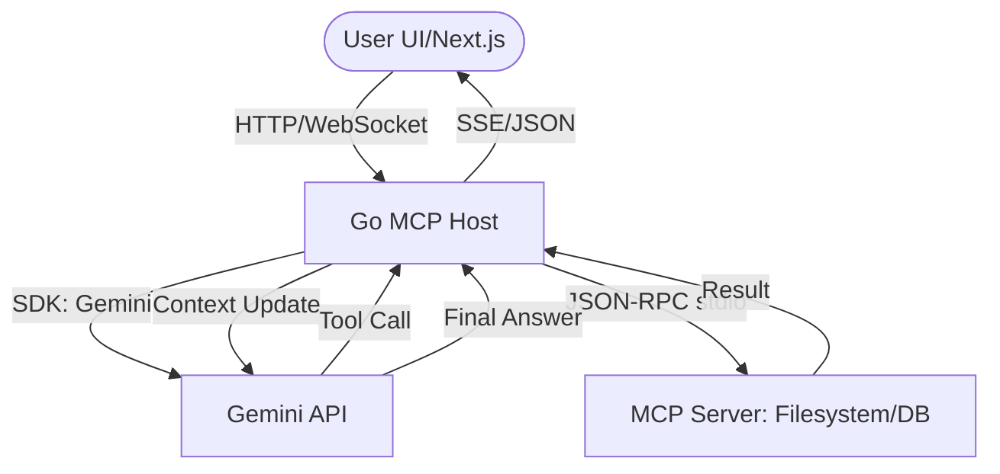

# 🏗️ Tech Design Document (TDD) — Custom MCP Host

## 1. System Architecture



## 2. Tech Stack
- **Backend (Orchestrator)**: Go 1.22+
  - `github.com/mark3labs/mcp-go`: MCP Client & Server SDK.
  - `github.com/google/generative-ai-go`: Gemini AI SDK.
  - `github.com/gin-gonic/gin` hoặc `net/http`: API Layer.
- **Frontend (Optional/Interface)**: Next.js 14+ (App Router)
  - `TailwindCSS`: Styling.
  - `Lucide React`: Icons.
- **Protocol**: JSON-RPC 2.0 over `stdio` (Internal) and REST/SSE (External).

## 3. Data Structures

### 3.1 Tool Schema Mapping (Go)
Mapping từ `mcp.Tool` (JSON Schema) sang `genai.FunctionDeclaration`.

```go
// Ví dụ struct mapping
type ToolMapper struct {}
func (m *ToolMapper) ToGemini(tool mcp.Tool) *genai.FunctionDeclaration {
    // Logic mapping parameters schema
}
```

## 4. Components

### 4.1 `MCPClientManager` (Go)
- Quản lý vòng đời các MCP Server.
- Khởi tạo `mcp.StdioClientTransport`.
- Duy trì kết nối và xử lý heartbeat.

### 4.2 `GeminiOrchestrator` (Go)
- Tích hợp Gemini SDK.
- Xử lý `Agentic Loop`: Gửi tin nhắn -> Nhận Tool Call -> Gọi MCP -> Trả kết quả -> Lặp lại.

### 4.3 `API Gateway` (Go)
- Cung cấp endpoint cho Next.js gọi.
- Hỗ trợ Server-Sent Events (SSE) để stream kết quả từ LLM về UI.

## 5. Sequence Diagram (Full Flow)

1. **Next.js** gửi prompt tới **Go Host**.
2. **Go Host** gọi `Gemini` kèm danh sách tools từ **MCP Server**.
3. **Gemini** yêu cầu gọi tool (ví dụ: `list_files`).
4. **Go Host** thực thi qua `mcp-go` xuống **MCP Server**.
5. **MCP Server** trả kết quả qua `stdio`.
6. **Go Host** nạp kết quả vào context và gọi lại **Gemini**.
7. **Gemini** trả lời text cuối cùng.
8. **Go Host** trả kết quả về cho **Next.js**.

## 6. Security Considerations
- **API Key Management**: Lưu trữ trong biến môi trường hoặc Secret Manager.
- **Input Sanitization**: Kiểm tra tham số từ LLM trước khi thực thi tool.
- **Process Isolation**: Chạy MCP Server với quyền user hạn chế.
